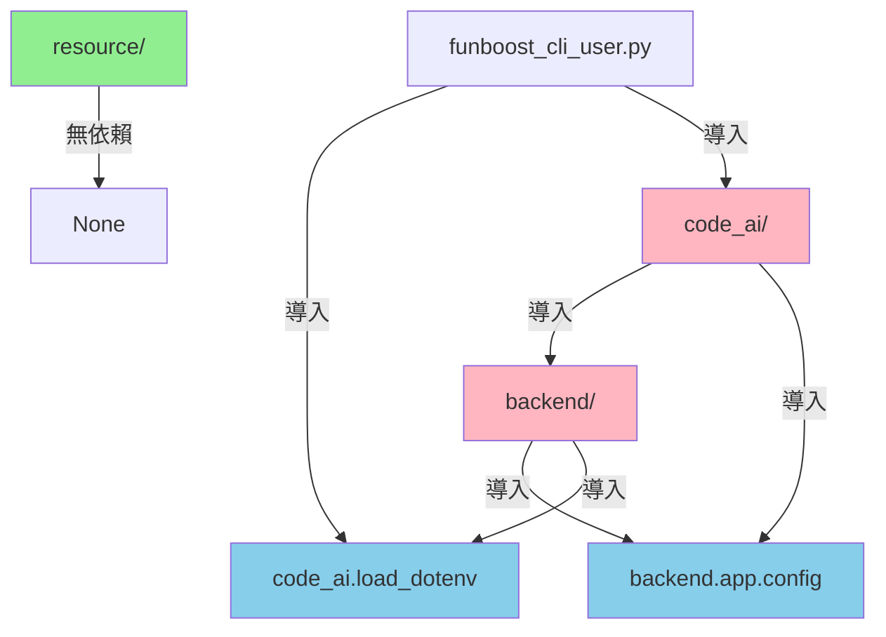

# 依賴關係分析 (Dependency Analysis)

## 模組依賴圖



## 詳細依賴關係

### 1. resource/ (綠色 - 無依賴)

**路徑**: `resource/`

**依賴**: 無

**影響**: 可獨立複製或符號連結

```bash
resource/
├── script/
│   ├── test.py
│   ├── path_post.py
│   └── dicom_processing_strategy.py
└── ...
```

**結論**: ✅ **完全獨立**，不依賴任何專案模組

---

### 2. backend.app.config (藍色 - 配置模組)

**路徑**: `backend/app/config/`

**提供功能**:
- `get_environment()` - 取得當前環境 (production/testing)
- `get_config()` - 取得環境特定配置
- `validate_environment()` - 驗證環境

**依賴**: 僅標準庫 (os, typing)

**被依賴**:
- `backend/app/database.py`
- `code_ai/` (多個模組)

**程式碼範例**:

```python
# backend/app/config/environments.py
import os

def get_environment() -> str:
    """取得 ENV 環境變數"""
    return os.getenv("ENV", "production")

# backend/app/database.py
from backend.app.config import get_environment

env = get_environment()  # "production" 或 "testing"
```

**結論**: ✅ **核心配置模組**，環境感知的基礎

---

### 3. code_ai.load_dotenv (藍色 - 配置載入)

**路徑**: `code_ai/__init__.py`

**提供功能**:
- `load_dotenv()` - 載入 .env 檔案

**依賴**: `python-dotenv`

**被依賴**:
- `backend/app/main.py`
- `funboost_cli_user.py`

**程式碼範例**:

```python
# code_ai/__init__.py
def load_dotenv():
    from dotenv import load_dotenv
    load_dotenv()  # 載入 .env 檔案

# backend/app/main.py
from code_ai import load_dotenv

if __name__ == "__main__":
    load_dotenv()  # 啟動時載入環境變數
    # ...
```

**結論**: ✅ **啟動時配置載入**

---

### 4. backend/ → code_ai (粉紅色 - 循環依賴)

**依賴關係**:

```python
# backend/app/main.py
from code_ai import load_dotenv  # ✅ 僅啟動時使用

# code_ai/utils/database.py
from backend.app.database import ...  # ⚠️ 循環依賴

# code_ai/pipeline/*.py
from backend.app.sync.schemas import ...  # ⚠️ 循環依賴
```

**問題分析**:

| 檔案 | 導入來源 | 風險等級 |
|------|----------|----------|
| `backend/app/main.py` | `code_ai.load_dotenv` | 🟢 低 (僅啟動時) |
| `code_ai/utils/database.py` | `backend.app.database` | 🟡 中 (運行時) |
| `code_ai/pipeline/*.py` | `backend.app.sync.schemas` | 🟡 中 (運行時) |

**影響**:

1. **符號連結方案**: ✅ 可行
   - 兩個資料夾共享相同的 `backend/` 和 `code_ai/`
   - 循環依賴不影響運行

2. **完整複製方案**: ✅ 可行
   - 每個資料夾有完整的 `backend/` 和 `code_ai/`
   - 循環依賴在同一資料夾內解決

**建議**:

⚠️ **長期優化**: 考慮提取共享模組

```
專案根目錄/
├── shared/              # 新增
│   ├── config.py       # load_dotenv, get_environment
│   └── schemas.py      # 共享資料結構
│
├── backend/
│   └── app/
│       ├── main.py     # from shared.config import load_dotenv
│       └── database.py # from shared.config import get_environment
│
└── code_ai/
    ├── __init__.py     # from shared.config import load_dotenv
    └── utils/
        └── database.py # from shared.config import get_environment
```

**優點**:
- ✅ 解除循環依賴
- ✅ 提高模組獨立性
- ✅ 符號連結更安全

**實作時間**: 約 30-60 分鐘

---

### 5. funboost_cli_user.py (入口檔案)

**路徑**: `funboost_cli_user.py`

**依賴**:
- `code_ai.load_dotenv` - 載入環境變數
- `code_ai.scheduler.*` - 排程器模組

**程式碼範例**:

```python
# funboost_cli_user.py
from code_ai import load_dotenv
load_dotenv()  # 載入 .env

from code_ai.scheduler.scheduler_check_add_task import add_raw_dicom_to_nii_inference

# ... Funboost CLI 啟動
```

**結論**: ✅ **正常依賴**，透過 code_ai 模組運作

---

## 兩資料夾部署可行性分析

### 方案 A: 符號連結 (推薦)

**目錄結構**:

```
/home/david/
├── brain-parcellation/          # Production
│   ├── backend/                 # 實體目錄
│   ├── code_ai/                 # 實體目錄
│   ├── resource/                # 實體目錄
│   ├── .env -> .env.production  # 符號連結
│   └── ...
│
└── brain-parcellation-testing/  # Testing
    ├── backend -> ../brain-parcellation/backend/     # 符號連結
    ├── code_ai -> ../brain-parcellation/code_ai/     # 符號連結
    ├── resource -> ../brain-parcellation/resource/   # 符號連結
    ├── .env -> .env.testing                          # 符號連結
    └── ...
```

**依賴分析**:

| 模組 | 實體位置 | Testing 連結 | 狀態 |
|------|----------|--------------|------|
| backend | Production | 符號連結 | ✅ 共享 |
| code_ai | Production | 符號連結 | ✅ 共享 |
| resource | Production | 符號連結 | ✅ 共享 |
| .env | `.env.testing` | 符號連結 | ✅ 獨立 |

**循環依賴處理**: ✅ 無問題
- 兩環境共享相同的 `backend/` 和 `code_ai/`
- 循環導入在同一目錄內

**優點**:
- ✅ 節省磁碟空間 (50%)
- ✅ 程式碼更新同步
- ✅ 快速部署 (< 1 分鐘)

**缺點**:
- ⚠️ 無法測試不同版本程式碼
- ⚠️ Windows 需管理員權限

---

### 方案 B: 完整複製

**目錄結構**:

```
/home/david/
├── brain-parcellation/          # Production (完整)
│   ├── backend/
│   ├── code_ai/
│   ├── resource/
│   └── ...
│
└── brain-parcellation-testing/  # Testing (完整複製)
    ├── backend/                 # 完整複製
    ├── code_ai/                 # 完整複製
    ├── resource/                # 完整複製
    └── ...
```

**依賴分析**:

| 模組 | Production | Testing | 狀態 |
|------|-----------|---------|------|
| backend | 實體 | 實體 (複製) | ✅ 獨立 |
| code_ai | 實體 | 實體 (複製) | ✅ 獨立 |
| resource | 實體 | 實體 (複製) | ✅ 獨立 |

**循環依賴處理**: ✅ 無問題
- 每個環境有完整的 `backend/` 和 `code_ai/`
- 循環導入在各自目錄內

**優點**:
- ✅ 完全獨立，可測試不同版本
- ✅ 不需特殊權限

**缺點**:
- ❌ 佔用雙倍磁碟空間
- ❌ 複製耗時 (2-5 分鐘)
- ❌ 程式碼更新需手動同步

---

## 首次部署時間評估

### 情境 1: Production 已部署 + 新增 Testing (符號連結)

| 步驟 | 時間 | 操作 |
|------|------|------|
| 建立 Testing 資料夾 | 10 秒 | `mkdir brain-parcellation-testing` |
| 建立符號連結 | 30 秒 | `ln -s` × 6 個目錄/檔案 |
| 複製必要檔案 | 20 秒 | `cp` × 5 個檔案 |
| 啟動 Docker | 45 秒 | `docker-compose up -d` |
| 啟動 Backend + Funboost | 15 秒 | `brain-parcellation-start.sh` |
| **總計** | **< 2 分鐘** | ✅ **極快** |

### 情境 2: Production 已部署 + 新增 Testing (完整複製)

| 步驟 | 時間 | 操作 |
|------|------|------|
| 複製專案資料夾 | 2-5 分鐘 | `cp -r` (視專案大小) |
| 修改 .env | 10 秒 | `ln -sf .env.testing .env` |
| 啟動 Docker | 45 秒 | `docker-compose up -d` |
| 啟動 Backend + Funboost | 15 秒 | `brain-parcellation-start.sh` |
| **總計** | **3-7 分鐘** | ✅ **可接受** |

### 情境 3: 全新部署 (Production + Testing)

| 步驟 | 時間 | 操作 |
|------|------|------|
| 克隆專案 | 1-2 分鐘 | `git clone` |
| 安裝 Python 依賴 | 5-10 分鐘 | `uv sync` (首次) |
| 下載 Docker 映像 | 2-5 分鐘 | Docker pull (首次) |
| Production 設定 | 1 分鐘 | 配置 .env |
| Production 啟動 | 1 分鐘 | Docker + Backend |
| Testing 設定 (符號連結) | 1 分鐘 | 符號連結建立 |
| Testing 啟動 | 1 分鐘 | Docker + Backend |
| **總計** | **12-22 分鐘** | ✅ **首次部署** |

---

## 最小化部署配置

### 必需檔案 (Production 資料夾)

```
brain-parcellation/
├── backend/                    # ✅ 必需
├── code_ai/                    # ✅ 必需
├── resource/                   # ⚠️ 選用 (若無推理任務可省略)
├── funboost_cli_user.py        # ✅ 必需
├── funboost_config.py          # ✅ 必需
├── pyproject.toml              # ✅ 必需
├── docker-compose.yml          # ✅ 必需
├── .env.production             # ✅ 必需
├── .env.testing                # ✅ 必需
├── .env                        # ✅ 必需 (符號連結)
├── brain-parcellation-start.sh # ✅ 必需
└── brain-parcellation-stop.sh  # ✅ 必需
```

### 必需檔案 (Testing 資料夾 - 符號連結)

```
brain-parcellation-testing/
├── backend -> ../brain-parcellation/backend/           # 符號連結
├── code_ai -> ../brain-parcellation/code_ai/           # 符號連結
├── resource -> ../brain-parcellation/resource/         # 符號連結
├── funboost_cli_user.py -> ../brain-parcellation/funboost_cli_user.py  # 符號連結
├── funboost_config.py -> ../brain-parcellation/funboost_config.py      # 符號連結
├── pyproject.toml -> ../brain-parcellation/pyproject.toml              # 符號連結
├── docker-compose.yml          # 複製 (獨立)
├── .env.testing                # 複製 (獨立)
├── .env.production             # 複製 (參考)
├── .env                        # 符號連結 -> .env.testing
├── brain-parcellation-start.sh # 複製 (獨立)
└── brain-parcellation-stop.sh  # 複製 (獨立)
```

**磁碟空間對比**:

| 方案 | backend | code_ai | resource | 總計 |
|------|---------|---------|----------|------|
| 完整複製 | 2× | 2× | 2× | **100% + 100% = 200%** |
| 符號連結 | 1× | 1× | 1× | **100% + 5% ≈ 105%** |

---

## 依賴優化建議 (未來改進)

### 當前問題

```python
# ⚠️ 循環依賴
backend/app/main.py → code_ai.load_dotenv
code_ai/utils/database.py → backend.app.database
```

### 建議架構

```python
# ✅ 解除循環依賴
shared/
├── config.py          # load_dotenv, get_environment
└── schemas.py         # 共享資料結構

backend/
└── app/
    ├── main.py        # from shared.config import load_dotenv
    └── database.py    # from shared.config import get_environment

code_ai/
├── __init__.py        # from shared.config import load_dotenv
└── utils/
    └── database.py    # from shared.config import get_environment
```

### 重構步驟

1. 創建 `shared/` 模組 (10 分鐘)
2. 遷移 `load_dotenv` 到 `shared/config.py` (5 分鐘)
3. 遷移 `get_environment` 到 `shared/config.py` (5 分鐘)
4. 更新所有導入語句 (10 分鐘)
5. 測試驗證 (10 分鐘)

**總計**: 約 40 分鐘

**優點**:
- ✅ 解除循環依賴
- ✅ 提高程式碼清晰度
- ✅ 符號連結更安全

---

## 結論

### 兩資料夾部署可行性: ✅ **完全可行**

1. **推薦方案**: 符號連結 (方案 A)
2. **首次部署時間**: < 2 分鐘
3. **依賴關係**: 已確認無阻礙
4. **環境切換**: 僅需改變 `.env` 符號連結

### 依賴關係總結

| 模組 | 依賴 | 狀態 |
|------|------|------|
| resource | 無 | ✅ 獨立 |
| backend.app.config | 標準庫 | ✅ 核心 |
| code_ai.load_dotenv | python-dotenv | ✅ 工具 |
| backend ↔ code_ai | 循環 | ⚠️ 可用但建議優化 |

### 後續優化建議

1. **短期** (可選): 使用符號連結快速部署 Testing
2. **中期** (建議): 重構為 `shared/` 模組解除循環依賴
3. **長期** (可選): 考慮微服務架構完全分離 backend 和 code_ai
