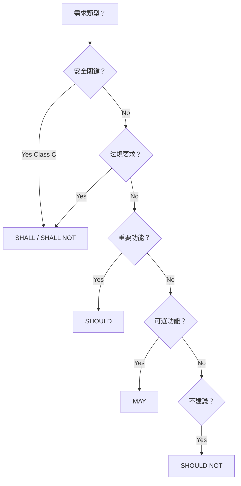

# RFC 2119 Requirement Keywords Guide

**文件編號**：RFC-2119-GUIDE
**版本**：1.0.0
**發布日期**：2025-01-15
**狀態**：Active
**適用範圍**：所有需求文件（PRD、SR、SD）

---

## 📋 目錄

1. [概述](#1-概述)
2. [RFC 2119 標準介紹](#2-rfc-2119-標準介紹)
3. [關鍵字定義與用法](#3-關鍵字定義與用法)
4. [醫療設備軟體應用](#4-醫療設備軟體應用)
5. [需求層級映射](#5-需求層級映射)
6. [常見錯誤與修正](#6-常見錯誤與修正)
7. [需求審查檢查表](#7-需求審查檢查表)
8. [附錄：快速參考](#8-附錄快速參考)

---

## 1. 概述

### 1.1 目的

本指南提供 **RFC 2119 關鍵字**（SHALL, MUST, SHOULD, MAY 等）的權威定義、使用規則與醫療設備軟體開發中的最佳實踐。

### 1.2 適用範圍

- ✅ **系統需求**（System Requirements - SR）
- ✅ **軟體需求**（Software Requirements - Frontend/Backend SR）
- ✅ **設計規範**（Software Design Specification - SDD）
- ✅ **測試計畫**（Software Test Plan - STP）
- ✅ **SOUP 需求**（SOUP Requirements Specification）
- ✅ **風險控制措施**（Risk Control Measures）

### 1.3 與 IEC 62304 整合

RFC 2119 關鍵字用於明確表達 **IEC 62304** 軟體需求的強制性等級：

| IEC 62304 需求類型 | 建議 RFC 2119 關鍵字 | 說明 |
|------------------|---------------------|------|
| **安全關鍵需求** | **SHALL** / **MUST** | Class C 軟體的安全功能 |
| **功能需求** | **SHALL** / **SHOULD** | 必須實現的功能 |
| **性能需求** | **SHOULD** / **SHALL** | 依據風險等級決定 |
| **可選功能** | **MAY** / **SHOULD** | 非必要但建議的功能 |
| **禁止行為** | **SHALL NOT** / **MUST NOT** | 安全禁止項 |

---

## 2. RFC 2119 標準介紹

### 2.1 RFC 2119 簡介

**RFC 2119: "Key words for use in RFCs to Indicate Requirement Levels"**
- **發布者**：Internet Engineering Task Force (IETF)
- **發布日期**：1997 年 3 月
- **作者**：S. Bradner
- **用途**：定義需求文件中的關鍵字，用於明確表達需求的強制性等級

### 2.2 為什麼使用 RFC 2119？

| 問題 | RFC 2119 解決方案 |
|------|------------------|
| ❌ 需求模糊（"系統應該..."） | ✅ 明確強制性（"系統 SHALL..."） |
| ❌ 實現者自行解讀 | ✅ 標準化解讀 |
| ❌ 測試驗收標準不清 | ✅ 可驗證性（SHALL = 必須測試） |
| ❌ 合規性模糊 | ✅ 審計追溯性（SHALL = 100% 符合） |

### 2.3 醫療設備軟體中的重要性

在 **IEC 62304** 和 **FDA 510(k)** 提交中，需求的模糊性可能導致：
- ❌ 審查延遲或拒絕
- ❌ 軟體缺陷未被發現
- ❌ 安全風險未被控制
- ❌ 測試覆蓋率不足

RFC 2119 提供 **法律級別的精確性**，確保需求的可測試性與可驗證性。

---

## 3. 關鍵字定義與用法

### 3.1 MUST / SHALL（絕對必須）

#### 📌 定義
表示需求為 **絕對強制**，必須 100% 實現，無例外。

#### 🔑 原文定義（RFC 2119）
> "MUST" / "SHALL" mean that the definition is an absolute requirement of the specification.

#### ✅ 使用場景
- 安全關鍵功能（Safety-critical features）
- 法規強制要求（Regulatory mandates）
- 數據完整性保證（Data integrity guarantees）
- 安全控制措施（Security controls）

#### 📝 醫療設備範例

##### 範例 1：安全關鍵功能（Class C）
```markdown
**SR-SAFE-001: 藥物劑量驗證**
系統 SHALL 在藥物注射前驗證劑量是否在安全範圍內（0.1 - 10.0 mL/hr）。

**理由**：防止過量注射導致低血糖休克（風險 HS-001, Class C）
**驗證**：測試所有劑量邊界值（0.1, 10.0, -1, 100）
```

##### 範例 2：數據完整性（HIPAA 合規）
```markdown
**SR-DATA-005: 患者數據加密**
系統 SHALL 使用 AES-256 加密演算法加密所有靜態患者健康資訊（PHI）。

**理由**：HIPAA § 164.312(a)(2)(iv) 強制要求
**驗證**：檢查數據庫檔案，確認所有 PHI 欄位已加密
```

#### ❌ 錯誤用法
```markdown
❌ 系統 MUST 盡可能快速回應  （模糊，無法驗證）
✅ 系統 SHALL 在 1 秒內回應 API 請求  （明確，可驗證）

❌ 系統 SHALL 提供良好的使用者體驗  （主觀，無法測試）
✅ 系統 SHOULD 在表單輸入錯誤時提供即時反饋  （具體，可測試）
```

---

### 3.2 MUST NOT / SHALL NOT（絕對禁止）

#### 📌 定義
表示行為為 **絕對禁止**，任何情況下都不得發生。

#### 🔑 原文定義（RFC 2119）
> "MUST NOT" / "SHALL NOT" mean that the definition is an absolute prohibition of the specification.

#### ✅ 使用場景
- 安全禁止行為（Safety prohibitions）
- 數據洩露防護（Data leak prevention）
- 系統故障防護（Failure mode prevention）
- 法規禁止項（Regulatory prohibitions）

#### 📝 醫療設備範例

##### 範例 1：安全禁止（Class C）
```markdown
**SR-SAFE-010: 警報抑制禁止**
系統 SHALL NOT 允許使用者永久關閉高優先級警報（紅色警報）。

**理由**：IEC 60601-1-8 § 6.2.2.3 禁止關閉生命支持設備警報
**驗證**：嘗試關閉警報，確認系統拒絕操作
```

##### 範例 2：數據洩露防護（GDPR 合規）
```markdown
**SR-SEC-008: 未加密傳輸禁止**
系統 SHALL NOT 透過未加密的通道傳輸患者個人識別資訊（PII）。

**理由**：GDPR Article 32 - 數據傳輸安全
**驗證**：網路流量分析，確認所有 PII 使用 TLS 1.3 傳輸
```

#### ❌ 錯誤用法
```markdown
❌ 系統 MUST NOT 使用舊版加密演算法  （太寬泛）
✅ 系統 SHALL NOT 使用 MD5 或 SHA-1 進行密碼雜湊  （具體演算法）

❌ 系統 SHALL NOT 當機  （無法保證）
✅ 系統 SHALL 在任何單一組件故障時維持基本操作  （具體故障模式）
```

---

### 3.3 SHOULD / RECOMMENDED（強烈建議）

#### 📌 定義
表示需求為 **強烈建議**，除非有充分理由，否則應實現。若不實現，需記錄原因。

#### 🔑 原文定義（RFC 2119）
> "SHOULD" / "RECOMMENDED" mean that there may exist valid reasons in particular circumstances to ignore a particular item, but the full implications must be understood and carefully weighed before choosing a different course.

#### ✅ 使用場景
- 最佳實踐（Best practices）
- 性能優化（Performance optimizations）
- 使用者體驗改進（UX improvements）
- 非關鍵安全功能（Non-critical safety features）

#### 📝 醫療設備範例

##### 範例 1：使用者體驗（Class B）
```markdown
**SR-UX-015: 操作確認反饋**
系統 SHOULD 在關鍵操作完成後提供視覺與聽覺確認反饋。

**理由**：IEC 62366-1 可用性工程建議，降低操作錯誤風險
**不實現情況**：若設備已有獨立的指示燈系統，可豁免軟體反饋
**驗證**：使用者測試，測量操作確認時間
```

##### 範例 2：性能優化（Class A）
```markdown
**SR-PERF-020: 數據預加載**
系統 SHOULD 在使用者登入時預加載常用患者數據，以減少後續查詢延遲。

**理由**：改善使用者體驗，減少等待時間
**不實現情況**：若數據量過大（> 100 MB），可改用按需加載
**驗證**：測量首次數據查詢時間（目標 < 500 ms）
```

#### ⚠️ SHOULD 的責任
若團隊決定 **不實現 SHOULD 需求**，必須：
1. **記錄決策理由**（Decision Rationale）
2. **評估替代方案**（Alternative Approaches）
3. **風險評估**（Risk Assessment）
4. **獲得利害關係人批准**（Stakeholder Approval）

---

### 3.4 SHOULD NOT / NOT RECOMMENDED（不建議）

#### 📌 定義
表示行為為 **不建議**，除非有充分理由，否則不應實現。

#### 🔑 原文定義（RFC 2119）
> "SHOULD NOT" / "NOT RECOMMENDED" mean that there may exist valid reasons in particular circumstances when the particular behavior is acceptable or even useful, but the full implications should be understood and the case carefully weighed before implementing any behavior described with this label.

#### ✅ 使用場景
- 已知不良實踐（Known bad practices）
- 性能問題風險（Performance concerns）
- 安全風險（Security risks）
- 維護性問題（Maintainability issues）

#### 📝 醫療設備範例

##### 範例 1：安全風險（Class C）
```markdown
**SR-SEC-025: 明文密碼存儲禁止**
系統 SHOULD NOT 將使用者密碼以明文或可逆加密方式存儲。

**理由**：OWASP Top 10 - A02:2021 (Cryptographic Failures)
**例外情況**：僅在開發環境測試用途下，經過安全團隊批准
**替代方案**：使用 bcrypt 或 Argon2id 進行密碼雜湊
**驗證**：數據庫檢查，確認密碼欄位為不可逆雜湊
```

##### 範例 2：性能問題（Class B）
```markdown
**SR-PERF-030: 同步長時間操作避免**
系統 SHOULD NOT 在 UI 主執行緒執行同步的長時間數據處理（> 100 ms）。

**理由**：導致 UI 凍結，降低使用者體驗
**例外情況**：若數據量極小且處理時間 < 50 ms，可接受
**替代方案**：使用異步處理或背景任務
**驗證**：性能分析工具測量主執行緒阻塞時間
```

---

### 3.5 MAY / OPTIONAL（可選）

#### 📌 定義
表示需求為 **完全可選**，實現者可自由決定是否實現，不需理由。

#### 🔑 原文定義（RFC 2119）
> "MAY" / "OPTIONAL" mean that an item is truly optional. One vendor may choose to include the item because a particular marketplace requires it or because the vendor feels that it enhances the product while another vendor may omit the same item.

#### ✅ 使用場景
- 增值功能（Value-add features）
- 特定市場需求（Market-specific requirements）
- 實驗性功能（Experimental features）
- 客製化選項（Customization options）

#### 📝 醫療設備範例

##### 範例 1：增值功能（Class A）
```markdown
**SR-FEAT-040: 多語言支援**
系統 MAY 提供除英語外的其他語言介面（如西班牙語、中文）。

**理由**：特定市場需求（如美國西部、亞洲市場）
**實現考量**：依據目標市場決定實現語言
**驗證**：若實現，測試所有翻譯的準確性與一致性
```

##### 範例 2：客製化選項（Class A）
```markdown
**SR-UI-045: 主題顏色自訂**
系統 MAY 允許使用者自訂介面主題顏色（深色模式、淺色模式、高對比模式）。

**理由**：提升使用者體驗與無障礙性
**實現考量**：依據使用者反饋與開發資源決定
**驗證**：若實現，測試所有主題在不同螢幕上的可讀性
```

#### ⚠️ MAY 的測試責任
即使是 **MAY（可選）** 需求，若團隊決定實現，仍需：
1. **完整測試**（Full Testing）
2. **文件記錄**（Documentation）
3. **維護責任**（Maintenance Commitment）

---

### 3.6 關鍵字對比表

| 關鍵字 | 強制性 | 實現率期望 | 不實現需理由 | 測試要求 | 法規審計 |
|--------|--------|-----------|------------|---------|---------|
| **MUST / SHALL** | 絕對 | 100% | ❌ 不允許 | 100% 覆蓋 | 強制審計 |
| **MUST NOT / SHALL NOT** | 絕對禁止 | 0% | ❌ 不允許 | 100% 驗證 | 強制審計 |
| **SHOULD** | 強烈建議 | > 90% | ✅ 需理由 | 建議測試 | 建議審計 |
| **SHOULD NOT** | 不建議 | < 10% | ✅ 需理由 | 若實現需測試 | 建議審計 |
| **MAY** | 可選 | 自由 | ✅ 無需理由 | 若實現需測試 | 可選審計 |

---

## 4. 醫療設備軟體應用

### 4.1 按 IEC 62304 安全級別選擇關鍵字

| 安全級別 | 功能類型 | 建議關鍵字 | 範例 |
|---------|---------|-----------|------|
| **Class C** | 安全關鍵功能 | **SHALL** / **SHALL NOT** | 藥物劑量驗證、警報系統 |
| **Class C** | 風險控制措施 | **SHALL** | 冗餘檢查、故障安全模式 |
| **Class B** | 重要功能 | **SHALL** / **SHOULD** | 數據記錄、報告生成 |
| **Class B** | 非關鍵功能 | **SHOULD** / **MAY** | 使用者介面優化 |
| **Class A** | 一般功能 | **SHOULD** / **MAY** | 數據可視化、報表匯出 |

### 4.2 按需求類型選擇關鍵字

#### 4.2.1 功能需求（Functional Requirements）

| 功能類型 | 關鍵字 | 範例 |
|---------|--------|------|
| 核心功能 | **SHALL** | 系統 SHALL 記錄所有警報事件到日誌 |
| 增強功能 | **SHOULD** | 系統 SHOULD 提供警報事件統計分析 |
| 可選功能 | **MAY** | 系統 MAY 匯出警報報告為 PDF |

#### 4.2.2 非功能需求（Non-Functional Requirements）

| 需求類型 | 關鍵字 | 範例 |
|---------|--------|------|
| **安全性** | **SHALL** / **SHALL NOT** | 系統 SHALL 在 3 次失敗登入後鎖定帳號 |
| **性能** | **SHALL** / **SHOULD** | 系統 SHALL 在 2 秒內載入患者數據（Class C）<br>系統 SHOULD 在 1 秒內載入患者數據（Class A） |
| **可靠性** | **SHALL** | 系統 SHALL 達到 99.9% 可用性（Class C） |
| **可用性** | **SHOULD** / **MAY** | 系統 SHOULD 符合 WCAG 2.1 AA 無障礙標準 |
| **可維護性** | **SHOULD** | 程式碼 SHOULD 達到 80% 測試覆蓋率 |

#### 4.2.3 介面需求（Interface Requirements）

| 介面類型 | 關鍵字 | 範例 |
|---------|--------|------|
| **硬體介面** | **SHALL** | 系統 SHALL 透過 RS-232 串口與感測器通訊 |
| **軟體介面** | **SHALL** | 系統 SHALL 使用 HL7 FHIR R4 格式交換患者數據 |
| **通訊協定** | **SHALL** / **SHALL NOT** | 系統 SHALL 使用 TLS 1.3 加密通訊<br>系統 SHALL NOT 使用 SSLv3 或 TLS 1.0 |

---

### 4.3 風險控制措施中的關鍵字

#### 📌 規則：風險控制措施必須使用 SHALL

根據 **IEC 62304:5.2.3** 與 **ISO 14971**，所有風險控制措施必須使用 **SHALL** 或 **SHALL NOT**，以確保可驗證性。

#### 📝 範例：風險控制需求

```markdown
**風險 ID**：HS-001
**危害場景**：感測器數據錯誤導致錯誤診斷
**嚴重性**：嚴重（Serious Injury）
**安全級別**：Class C

**風險控制措施（Software Requirements）**：

**SR-RISK-001: 數據範圍驗證**
系統 SHALL 驗證所有感測器數據是否在生理合理範圍內（心率: 30-300 bpm, 血壓: 40-250 mmHg）。

**SR-RISK-002: 冗餘讀取**
系統 SHALL 從感測器讀取 3 次數據，並使用中位數作為最終值。

**SR-RISK-003: 異常檢測**
系統 SHALL 在檢測到數據異常時觸發紅色高優先級警報。

**SR-RISK-004: 故障安全模式**
系統 SHALL 在感測器自檢失敗時自動進入故障安全模式，並通知使用者。

**驗證**：
- TC-RISK-001-01: 測試邊界值（29, 30, 300, 301 bpm）
- TC-RISK-002-01: 模擬感測器噪音，驗證中位數濾波
- TC-RISK-003-01: 注入錯誤數據（-999, 9999），驗證警報觸發
- TC-RISK-004-01: 模擬感測器故障，驗證故障安全模式啟動
```

---

## 5. 需求層級映射

### 5.1 MoSCoW 方法對應

| MoSCoW | RFC 2119 | 說明 |
|--------|----------|------|
| **Must Have** | **SHALL** / **MUST** | 產品發布的必要功能 |
| **Should Have** | **SHOULD** | 重要但非關鍵的功能 |
| **Could Have** | **MAY** / **SHOULD** | 可選但有價值的功能 |
| **Won't Have (this time)** | ❌ 不寫入需求 | 明確排除的功能 |

### 5.2 使用者故事對應

| 使用者故事優先級 | RFC 2119 | Scrum 優先級 |
|---------------|----------|-------------|
| **Critical** | **SHALL** | P0 |
| **High** | **SHALL** / **SHOULD** | P1 |
| **Medium** | **SHOULD** | P2 |
| **Low** | **MAY** | P3 |

### 5.3 需求追溯範例

```markdown
**使用者需求（UR-001）**：
醫生 MAY 查看患者的歷史生命體徵趨勢圖，以協助診斷。

**系統需求（SR-FUNC-010）**：
系統 SHOULD 提供患者生命體徵的時間序列圖表（過去 7 天）。

**前端需求（FE-SR-020）**：
前端 SHALL 使用 Chart.js 渲染生命體徵趨勢圖。

**後端需求（BE-SR-045）**：
後端 SHALL 提供 API `/api/v1/patients/{id}/vitals?days=7`，返回 JSON 格式的生命體徵數據。

**測試用例（TC-SYS-010-001）**：
驗證：查詢患者 ID=123 的生命體徵數據，確認圖表顯示過去 7 天的心率、血壓數據。
```

---

## 6. 常見錯誤與修正

### 6.1 模糊性錯誤

| ❌ 錯誤寫法 | ✅ 正確寫法 | 說明 |
|-----------|-----------|------|
| 系統應該快速回應 | 系統 SHALL 在 1 秒內回應 API 請求 | 具體時間要求 |
| 系統必須安全 | 系統 SHALL 使用 AES-256 加密患者數據 | 具體安全措施 |
| 系統可能需要備份 | 系統 SHOULD 每 24 小時自動備份數據庫 | 明確備份頻率 |
| 系統不應該當機 | 系統 SHALL 在任何單一組件故障時維持基本操作 | 具體故障模式 |

### 6.2 關鍵字誤用

| ❌ 錯誤用法 | ✅ 正確用法 | 說明 |
|-----------|-----------|------|
| 系統 MAY 驗證藥物劑量（Class C） | 系統 SHALL 驗證藥物劑量 | 安全關鍵功能必須用 SHALL |
| 系統 SHALL 提供深色模式（Class A） | 系統 MAY 提供深色模式 | 非關鍵功能用 MAY |
| 系統 SHOULD 加密患者數據（HIPAA） | 系統 SHALL 加密患者數據 | 法規要求用 SHALL |
| 系統 MUST 盡量避免錯誤 | 系統 SHALL 在檢測到錯誤時記錄到日誌 | 具體行為描述 |

### 6.3 非可驗證需求

| ❌ 不可驗證 | ✅ 可驗證 | 驗證方式 |
|-----------|---------|---------|
| 系統 SHALL 易於使用 | 系統 SHALL 在使用者測試中達到 > 80% 任務成功率 | 使用者測試 |
| 系統 SHALL 高效能 | 系統 SHALL 在 < 2 秒內處理 1000 筆患者數據查詢 | 性能測試 |
| 系統 SHALL 可擴展 | 系統 SHALL 支援水平擴展至 10 個伺服器節點 | 擴展測試 |
| 系統 SHALL 安全 | 系統 SHALL 通過 OWASP Top 10 安全掃描，無高危漏洞 | 安全掃描 |

---

## 7. 需求審查檢查表

### 7.1 關鍵字正確性檢查

- [ ] 所有 **Class C** 安全關鍵功能使用 **SHALL** 或 **SHALL NOT**
- [ ] 所有風險控制措施使用 **SHALL** 或 **SHALL NOT**
- [ ] 法規強制要求（HIPAA, GDPR, FDA）使用 **SHALL**
- [ ] 可選功能使用 **MAY** 或 **SHOULD**
- [ ] 不建議行為使用 **SHOULD NOT**，並記錄例外理由

### 7.2 可驗證性檢查

- [ ] 每個 **SHALL** 需求都有對應的測試用例（TC-XXX-XXX）
- [ ] 每個需求都有明確的驗收標準（數值、時間、範圍）
- [ ] 每個 **SHOULD** 需求記錄了不實現的條件
- [ ] 每個 **MAY** 需求記錄了實現考量

### 7.3 追溯性檢查

- [ ] 每個 SR 需求追溯至 UR 或 PRD
- [ ] 每個風險控制措施追溯至風險 ID（HS-XXX）
- [ ] 每個設計決策追溯至對應需求
- [ ] 每個測試用例追溯至需求 ID

### 7.4 文件一致性檢查

- [ ] SRS、SDD、STP 使用相同的 RFC 2119 關鍵字定義
- [ ] 所有需求文件的關鍵字以 **大寫粗體** 顯示
- [ ] 每個需求文件開頭引用 RFC 2119 標準

---

## 8. 附錄：快速參考

### 8.1 關鍵字快速決策樹



### 8.2 RFC 2119 關鍵字速查表

| 關鍵字 | 中文 | 實現率 | 測試要求 | 例外處理 |
|--------|------|--------|---------|---------|
| **MUST** | 必須 | 100% | 強制 | 不允許 |
| **SHALL** | 應當 | 100% | 強制 | 不允許 |
| **MUST NOT** | 禁止 | 0% | 強制 | 不允許 |
| **SHALL NOT** | 不應 | 0% | 強制 | 不允許 |
| **SHOULD** | 建議 | > 90% | 建議 | 需記錄理由 |
| **RECOMMENDED** | 推薦 | > 90% | 建議 | 需記錄理由 |
| **SHOULD NOT** | 不建議 | < 10% | 若實現需測試 | 需記錄理由 |
| **NOT RECOMMENDED** | 不推薦 | < 10% | 若實現需測試 | 需記錄理由 |
| **MAY** | 可以 | 自由 | 若實現需測試 | 無需理由 |
| **OPTIONAL** | 可選 | 自由 | 若實現需測試 | 無需理由 |

### 8.3 醫療設備範例速查

#### 安全關鍵（Class C）
```markdown
✅ 系統 SHALL 在藥物注射前驗證劑量範圍（0.1 - 10.0 mL/hr）
✅ 系統 SHALL NOT 允許使用者關閉紅色高優先級警報
✅ 系統 SHALL 在感測器故障時自動進入故障安全模式
```

#### 重要功能（Class B）
```markdown
✅ 系統 SHOULD 在 1 秒內載入患者數據
✅ 系統 SHOULD 在關鍵操作後提供視覺確認反饋
✅ 系統 SHOULD NOT 在 UI 主執行緒執行長時間操作
```

#### 可選功能（Class A）
```markdown
✅ 系統 MAY 提供多語言介面（英語、西班牙語、中文）
✅ 系統 MAY 允許使用者自訂主題顏色
✅ 系統 MAY 匯出報告為 PDF 或 Excel 格式
```

---

## 📚 參考資料

1. **RFC 2119** - "Key words for use in RFCs to Indicate Requirement Levels"
   https://www.ietf.org/rfc/rfc2119.txt

2. **IEC 62304:2006+AMD1:2015** - Medical device software - Software lifecycle processes

3. **ISO 14971:2019** - Medical devices - Application of risk management to medical devices

4. **FDA Guidance** - "General Principles of Software Validation"
   https://www.fda.gov/regulatory-information/search-fda-guidance-documents/general-principles-software-validation

5. **IEC 60601-1-8:2006** - Medical electrical equipment - Collateral standard: General requirements for basic safety and essential performance - Alarm systems

---

**文件歷史**：
- **v1.0.0** (2025-01-15): 初始版本，完整 RFC 2119 指南與醫療設備範例
